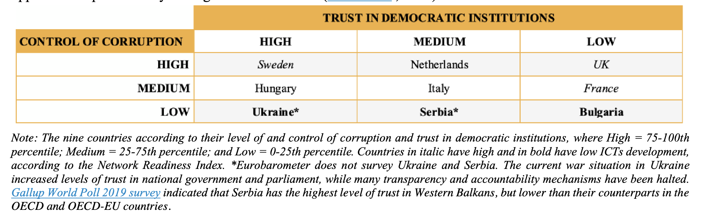

# Task 8.1 – Investigating Corruption and Anti-Corruption Discourse

**Lead institution**: University of Amsterdam (UvA)  
**Collaborating partners**: ACREC, Sciences Po, UGOT, Unibo, KCL, IGA, GTI  
**Project timeline**: Months 3–18

## Overview

Task 8.1 investigates the social construction of corruption and anti-corruption in legacy and social media. We apply advanced computational methods combined with manual annotation to analyze large-scale textual data from news and Meta social media platforms.

## Objectives

This task seeks to:

- Examine public discourse on political corruption.  
- Collect media content from diverse sources, including news APIs and Meta’s public content library.  
- Investigate corruption coverage across nine countries for the period 2018–2024.

## Methodology

Data collection and analysis follow a two-step approach:

1. **Inductive Exploration** – Discover latent topics, frames, and actor networks.  
2. **Deductive Evaluation** – Analyze specific frames and actors about political corruption and actor roles.

## Country selection

## Search term strategy

A curated list of search terms is used to retrieve articles related to political corruption.

## Data Sources and Usage

News content is retrieved via [NewsAPI.ai](https://newsapi.ai). Due to copyright and licensing restrictions, full-text articles are **not included** in this repository.

Researchers interested in replicating or extending this work may:

- Request access to NewsAPI.ai or other platforms used.  
- Use the provided search term lists and methodological templates.  
- Contact the project team for academic collaboration.

---
## Data availability

This repository includes metadata and code for analyzing media coverage of corruption.

Note:  
- Full-text news articles are **not publicly redistributed** due to copyright restrictions.  
- All news content was accessed via NewsAPI.ai.

## Licensing

The code in this repository is licensed under the [MIT License](LICENSE).  
All rights to third-party data (e.g., news articles) remain with the original copyright holders.
